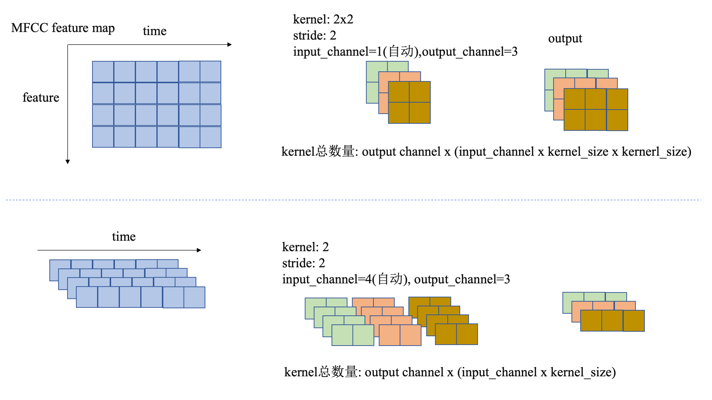

# 前言

一般音频会处理成MFCC频谱图再接入网络进行学习，一维卷积和二维卷积的处理方式都遇见过，但是没有仔细思考过其中的区别

# 正文

conv1d能够较为方便的控制最终的feature大小，kernel size、stride、pad只会影响时间维度，而conv2d则把(feature,time)大小的MFCC频谱图当作二维（图像）来处理，这样feature最终的大小无法准确的控制，会由kernel size、stride、pad共同决定。（当然，可以使用channel pooling等操作手动控制）

如图所示，上半部分表示conv2d，下半部分表示conv1d：

===. 

